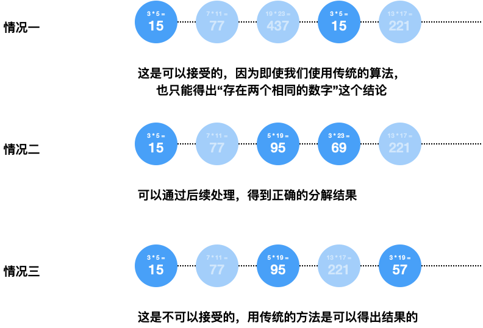

# KeyMiningAlgotithm

## 背景

我们从公网中爬取了大量的 RSA 公钥证书、得到它们公开的大整数 N 之后，需要进行对得到的整数进行一些统计分析，其中最重要的一个统计步骤就是密钥分解。我们非常容易地想到一个非常传统的分解算法一一匹配求解 GCD，以一次 GCD 作为单位时间，设我们得到了 M 个 RSA 密钥证书，那么传统算法的耗时将是 $$\displaystyle \frac{M^2}{2}$$，这显然是不可以接受的，我们需要一个更高效的分解算法。

原论文给出了一个通过乘法树、模因子树的方式求解多个大整数 N 乘积的方法。下面介绍一下这个算法的流程与原理，并且我们对这个算法进行了一些改进。

## 流程

### 乘法树构建

什么是乘法树？

- 一颗由叶子结点的列表构造出来的二叉树。任意一个的结点值是左右孩子结点值的乘积；

例子：

构成乘法树的流程：

1. 通过输入的整数列表，得到一个二叉树的叶子结点列表；
2. 通过二叉树的叶子结点列表自底向上构造出乘法树；
3. 返回乘法树的根节点；

当输入的结点数量不为 $$2^k$$ 时，叶子结点的排列策略有两种：

- 优先构建树：
- 优先清空队列：

后者的树高度显然要更低一些，我们应该使用第二种。

### 模因子树构建

什么是模因子树？

- 一颗由乘法树构造出来的二叉树。根节点与乘法树根节点值相同，任意一个结点的值通过其父节点的值与乘法树对应结点的平方取模得到。

例子：

构建流程：

1. 输入一棵构建好的乘法树，

2. 自顶向下开始，设每个结点的值为 V，其父节点的值为 P，做：$$V \equiv P \mod{ V^2 }$$

关于模因子树叶子结点值为 0 的讨论：

### 通过模因子树计算因子

对模因子树的叶子结点进行以下计算之后，可以得到的每个大整数的因子分解结果：

1. 将模因子树的叶子结点 r 与乘法树 p 对应的叶子结点做除法得到 q，即 $$\displaystyle q = \frac{p}{r}$$（可以[证明](#prove_ivide)结果一定是整除的）
2. 将整除的结果 q 与乘法树叶子结点 p 取最大公因子 g，即 $$g = gcd(q, p)$$

例子：

### 大整数去重

## 附录

### 结点整除的证明

设乘法树的根节点为 $$P_0$$，我们取一个乘法树的叶子结点的值 p，它对应的模因子树的叶子结点的值 r。

容易得到模因子树叶子结点值的本质是：$$r \equiv P_0 \pmod{p^2}$$，乘法树与模因子树都是为了以更加有效率的方式计算出这个值的辅助工具。

显然 p 是 $$P_0$$ 的因子，设 $$ P_0 = p * P_1$$。

因此：$$r \equiv p * P_1 \pmod{p^2} \rightarrow r \equiv 0 \mod{p}$$，得证。

