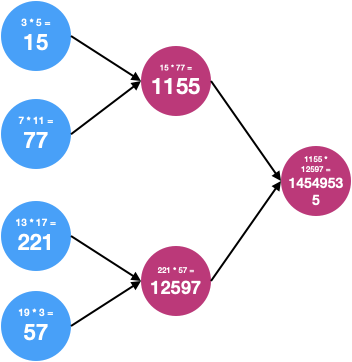
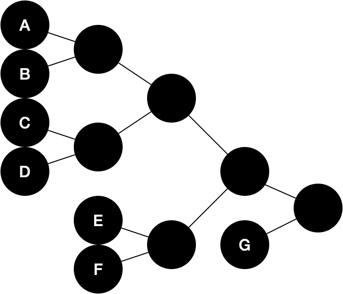
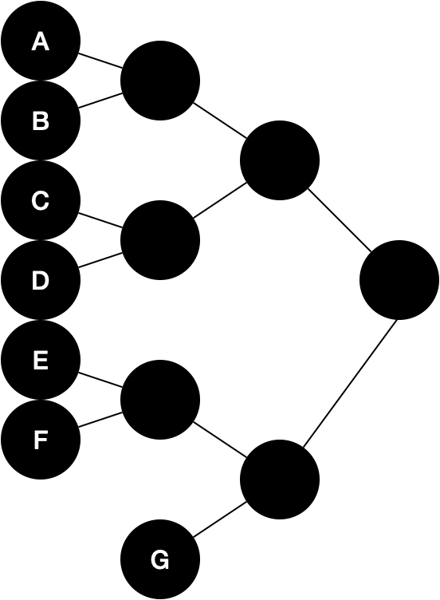
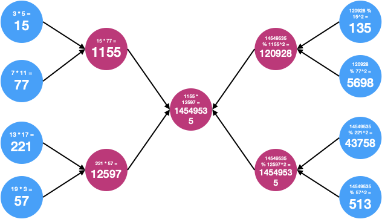
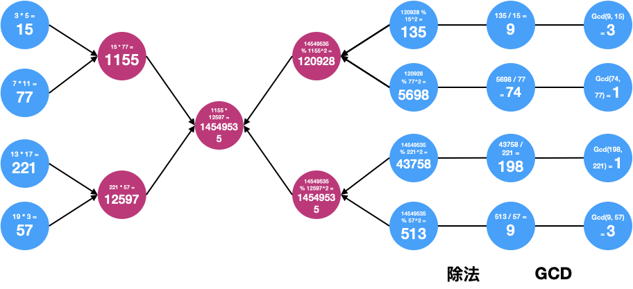
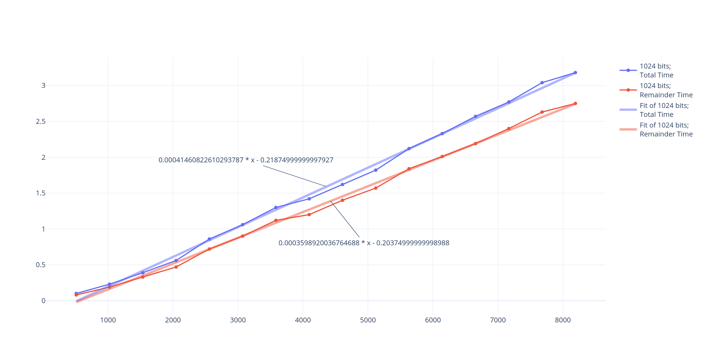
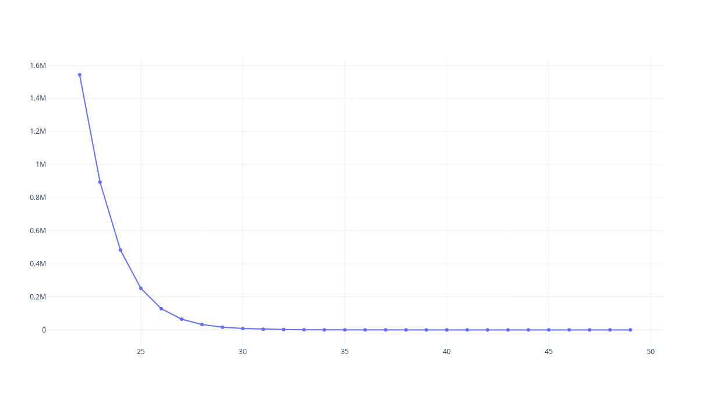

# KeyMiningAlgotithm

## 背景

我们从公网中爬取了大量的 RSA 公钥证书、得到它们公开的大整数 N 之后，需要进行对得到的整数进行一些统计分析，其中最重要的一个统计步骤就是密钥分解。我们非常容易地想到一个非常传统的分解算法一一匹配求解 GCD，以一次 GCD 作为单位时间，设我们得到了 M 个 RSA 密钥证书，那么传统算法的耗时将是 $$\displaystyle \frac{M^2}{2}$$，这显然是不可以接受的，我们需要一个更高效的分解算法。

原论文给出了一个通过乘法树、模因子树的方式求解多个大整数 N 乘积的方法。下面介绍一下这个算法的流程与原理，并且我们对这个算法进行了一些改进。

根据原文中提到的例子，我们本章中对时间、空间的判断，都假设我们得到了约 $$2 ^ {22}$$ 个 $$2^{20}$$ 大小的大整数。

## 流程

### 乘法树构建

什么是乘法树？

- 一颗由叶子结点的列表构造出来的二叉树。任意一个的结点值是左右孩子结点值的乘积；

例子：



构成乘法树的流程：

1. 通过输入的整数列表，得到一个二叉树的叶子结点列表；
2. 通过二叉树的叶子结点列表自底向上构造出乘法树；
3. 返回乘法树的根节点；

当输入的结点数量不为 $$2^k$$ 时，叶子结点的排列策略有两种：

- 优先构建树：
- 优先清空队列：

后者的树高度显然要更低一些，我们应该使用第二种。

### 模因子树构建

什么是模因子树？

- 一颗由乘法树构造出来的二叉树。根节点与乘法树根节点值相同，任意一个结点的值通过其父节点的值与乘法树对应结点的平方取模得到。

例子：



构建流程：

1. 输入一棵构建好的乘法树，

2. 自顶向下开始，设每个结点的值为 V，其父节点的值为 P，做：$$V \equiv P \mod{ V^2 }$$

关于模因子树叶子结点值为 N 的[讨论](#remainer_leaf_equal_0)。

### 通过模因子树计算因子

对模因子树的叶子结点进行以下计算之后，可以得到的每个大整数的因子分解结果：

1. 将模因子树的叶子结点 r 与乘法树 p 对应的叶子结点做除法得到 q，即 $$\displaystyle q = \frac{p}{r}$$（可以[证明](#prove_ivide)结果一定是整除的）
2. 将整除的结果 q 与乘法树叶子结点 p 取最大公因子 g，即 $$g = gcd(q, p)$$

例子：



### 大整数去重

大数字的范围大约是 $$(0,2^{20})$$ ，大整数数量约为 $$2^{22}$$。经过一些的[讨论](#redblacktree_or_hashmap)，我们决定使用哈希函数进行去重。

我们假设哈希函数是绝对随机的，对于生成 x 比特的哈希函数，设产生哈希冲突的概率为 p，我们可以计算它们之间的函数关系：

### 性能分析

我对代码进行了一轮重构，其中密钥分解对外暴露的 `.h` 文件结构如下：

```c++
class EffientlyGcd {
private:
    const std::vector<mpz_class>& rawNumbersVec;
    std::vector<mpz_class> finalGcdsVec;
    std::vector<mpz_class> bigNumbers;
    unsigned int step = 0;

    ProductTree *productTree = nullptr;
    RemainderTree *remainderTree = nullptr;

public:
    explicit EffientlyGcd(const std::vector<mpz_class> &rnv) : rawNumbersVec(rnv) {}

    void S0_excludeUnexpectedNumbers();
    void S1_buildProductTree();
     void S2_buildRemainderTree();
    void S3_getGcdsFromRTree();

    const std::vector<mpz_class> *getGcdVector() const;
    const ProductTree *getProductTree() const { return this->productTree; }
    ~EffientlyGcd();
};
```

其中 S0-S1 就是乘法树构建以知道 gcd 求解这个过程中的步骤。我们通过过 BOOST 测试了 1024 个 1024 比特大小的整数，测试结果如下（其中 wall 是包含系统中断的时间，CPU 是在 CPU 上进行运算的时间）：

```
Init :  0.000003s wall, 0.000000s user + 0.000000s system = 0.000000s CPU (n/a%)

STEP0:  0.000335s wall, 0.000000s user + 0.000000s system = 0.000000s CPU (n/a%)

STEP1:  0.022037s wall, 0.020000s user + 0.000000s system = 0.020000s CPU (90.8%)

STEP2:  0.252962s wall, 0.250000s user + 0.000000s system = 0.250000s CPU (98.8%)

STEP3:  0.278490s wall, 0.270000s user + 0.000000s system = 0.270000s CPU (97.0%)
```

三个主要步骤的时间执行比例是：

- 乘法树构建: 剩余树构建: 计算公因数 = `1:12:1`

可见主要的时间消耗在执行模因子树构建这个步骤上。模因子树的构建主要由平方与取模两个操作构成，经过同样的时间计算可得到二者的执行时间比：

- 平方: 取模 = `1:4`。也就是说算法的性能瓶颈在于取模运算。

通过运行测试不同数量的大整数（测试时机器上不应该运行其他 CPU 密集型任务），我们得到了许多关于运行时间的数据，因此我们可以绘制以下的表格：



通过在我的电脑上的模拟，我们可以得出结论：

- $$1024^2$$ 比特的大整数数量与计算时间大致成正比例关系：$$Time = (4 \times 10^{-4}  \times Amount - 0.219)s$$
- 也就是说，如果我希望在我的电脑上计算 $$2^{22}$$ 个整数，这会花费约 $$1739.0s \approx 28.98min \approx 0.5h$$

这是完全可以接受的。

## 附录

<a id="remainer_leaf_equal_0"></a>

### 模因子树叶子结点为 0

设乘法树的根节点为 $$P_0$$，我们取一个乘法树的叶子结点的值 p，它对应的模因子树的叶子结点的值 r。

容易得到模因子树叶子结点值的本质是：$$r \equiv P_0 \pmod{p^2}$$，乘法树与模因子树都是为了以更加有效率的方式计算出这个值的辅助工具。

我们知道 p 是一个大整数，且它一定是两个大素数的积，我们设 $$P_0 = p * P_1, p = s * t$$（其中 s、t 是两个大素数）。那么：$$r = 0 \Leftrightarrow P_0 \equiv 0 \pmod{p^2} \Leftrightarrow p *P_1 \equiv 0 \pmod{p^2} \Leftrightarrow P_1 \equiv 0 \pmod{s * t}$$

也就说，除了 p 外，原大整数列表中至少还有一个 s 的倍数与一个 t 的倍数。分情况讨论：

1. 当 s、t 是同一个数字的因子时：这种情况是可以接受的，因为即使使用传统的方法，也只能得到“存在两个相同数字”的结论，而并不能分解他们；

2. 当 $$p_1 = s * s', p_2 = t * t', s' \not= t'$$ 时，p 不可以被分解，而 $$p_1,p_2$$ 可以被分解，但使用传统的、时间复杂度为 $$O(n^2) * time_{gcd}$$ 的分解算法，p 时可以被分解的。

   这种情况在某种程度上也是可以接受的，因为使用 $$p_1, p_2$$ 的分解结果 s、t 仍然可以将 p 分解。

3. 当 $$p_1 = s * s', p_2 = t * t', s' = t'$$ 时，$$p, p_1, p_2$$ 在这个算法中都是不可以分解的，进一步的，任何数量的、因子构成循环的大整数数列，在这个算法中都是不可分解的。

   这种情况是完全不可接受的，因为使用传统的、时间复杂度为 $$O(n^2) * time_{gcd}$$ 的分解算法，这些数字都是可以被轻松分解的；

为了规避上面三种情况提到的矛盾，我们希望在计算之前对大整数数列进行一次[大整数去重](#redblacktree_or_hashmap)，排除其中的第一种情况。于是，当我们得到的叶子结点为零时，我们可以断言：模因子树出现 0 位置的叶子结点对应的乘法树叶子结点，一定是可以分解的，我们可以使用穷举的办法得到它们的值。

<a id="prove_divide"></a>

### 结点整除的证明

重复上面的假设，通过上面的讨论可以得到 $$r \equiv P_0 \pmod{p^2}$$

显然 p 是 $$P_0$$ 的因子，设 $$ P_0 = p * P_1$$。

因此：$$r \equiv p * P_1 \pmod{p^2} \rightarrow r \equiv 0 \mod{p}$$，得证。

<a id="redblacktree_or_hashmap"></a>

### 大整数去重方式的讨论

在 C++、Java 等高级语言中，是内置了去重方法的，它就是 SDK 层面实现的 `set` 集合或 `dictionary` 字典的键去重。它们底层的实现方式大致有两种：红黑树与哈希表。

基于以下的一些原因，我决定使用哈希表而不是红黑树：

1. 实现红黑树必须将所有的整数同时加载到内存中来；
2. 红黑树的插入复杂度 $$O(log_2{n}), \text{n is depth of the tree}$$ 要高于哈希表的时间复杂度 $$O(1)$$。后者的时间主要取决于计算哈希函数的时间复杂度，而这个时间与整数的比特长度是正相关的。

关于哈希函数的讨论，我们假设哈希的生成比特长度为 x，对于规模为 $$2^{22}$$ 大小的大整数。我们可以类比成将 $$2^{22}$$  个整数放入 $$2^x$$ 个桶中。有以下分析：

1. 每个桶为空的概率：$$\displaystyle (1 - \frac{1}{2^{x}})^{2^{22}}$$
2. 空桶的期望个数 $$\displaystyle C = 2^x (1 - \frac{1}{2^x})^{2^{22}} = 2^x ((1 - \frac{1}{2^x})^{-2^x})^{-\frac{2^{22}}{2^x}}$$
3. 显然我们有 $$x > 22$$，于是我们可以认为 $$2^x \rightarrow \infin$$，因此 $$C = 2^x e^{-2^{22 - x}}$$ 
4. 发生冲突的期望个数，与空桶的期望个数是线性相关的：$$\displaystyle P = 2^{22} - 2^x + \frac{2^x}{e^{2^{22 - x}}}$$

将上面的函数绘制成一个离散曲线：



离散数据显示，当比特数为 43 上时，期望冲突次数降为 1，比特数为 49 时，期望冲突次数降为 0 ，可忽略。这也就是说我们需要尽可能的设计或选择一个比特数大于 50 的哈希函数。

